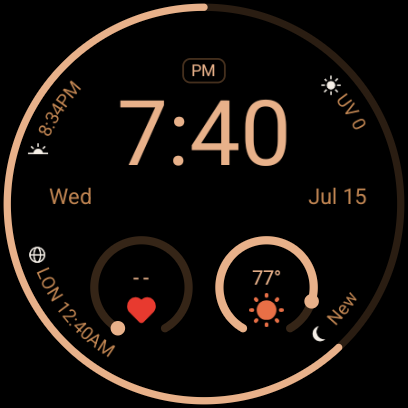
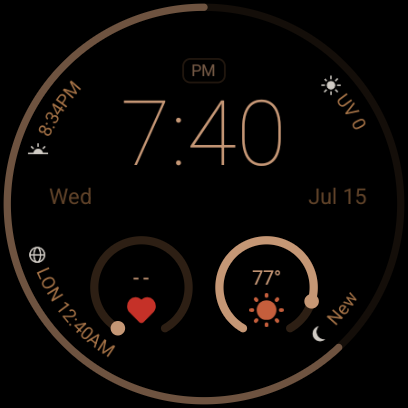

# Meridian

[](https://github.com/johnhringiv/meridian/actions/workflows/android.yml)

A clean digital watch face for Wear OS, built in the declarative [Watch Face Format](https://developer.android.com/training/wearables/wff) (no code, just XML — Google's renderer handles power, ambient, and burn-in optimization).

Named for the line the sun crosses at local noon — _ante meridiem_ and _post meridiem_, the AM/PM on the dial — and for the navigator's line of longitude.

The layout riffs on the stock Pixel digital face with two deliberate changes:

- **No mode label** — the center is time and date, nothing else.
- **The outer tick ring is a battery gauge** — a rim arc sweeps with charge level and shifts copper → amber (≤30%) → red (≤15%).

Plus two user-assignable complication circles, four curved rim complication slots (defaults: sunrise/sunset, UV, world clock, moon phase), and a selectable color theme (Copper / Silver / Sage).

| Interactive                                      | Ambient (AOD)                            |
| ------------------------------------------------ | ---------------------------------------- |
|  |  |

## Install (sideload)

Grab the APK from [Releases](https://github.com/johnhringiv/meridian/releases), then:

1. **On the watch** — enable developer mode: Settings → System → About → tap **Build number** 7 times. Then Settings → **Developer options** → enable **ADB debugging** and **Wireless debugging** (watch and computer on the same Wi-Fi).
2. **Pair (one time)** — on the watch open Wireless debugging → **Pair new device**; on your computer:
   ```
   adb pair <ip>:<pairing-port> <6-digit-code>
   ```
3. **Connect and install** — the main Wireless debugging screen shows a different port:
   ```
   adb connect <ip>:<port>
   adb install Meridian-v<version>.apk
   ```
4. Long-press the current watch face → pick **Meridian** → tap the face to assign the two complications and color theme.

Needs Wear OS 5+ (minSdk 34, WFF v2 — required by the heart-rate default complication; still covers every Pixel Watch). `adb` ships with [Android platform-tools](https://developer.android.com/tools/releases/platform-tools).

## Building from source

```
./gradlew :watchface:assembleDebug      # debug build
./gradlew :watchface:assembleRelease    # release (signed if keystore.properties exists, else unsigned)
```

Requires JDK 21 and the Android SDK (compileSdk 36). Release signing reads `keystore.properties` at the repo root (gitignored); CI restores it from the `KEYSTORE_B64` / `KEYSTORE_PASSWORD` secrets.

There is no live preview for WFF: iterate by building and installing on a watch (or emulator). CI runs the [WFF format validator and memory footprint check](https://github.com/google/watchface) on every build — a schema typo or memory-budget overage fails the PR instead of silently not rendering on-device.

After cloning, enable the repo hooks (auto-formats Markdown with Prettier on commit; CI enforces):

```
git config core.hooksPath .githooks
```

## Versioning

- **`versionCode`** (integer) — bumped on **every change** pushed to a feature branch; CI rejects PRs where it hasn't increased past `main`.
- **`versionName`** (e.g. `0.1`) — bumped **once per PR to `main`**; CI enforces it differs from `main`. Merges to `main` automatically publish a GitHub release with the APK.

## License

Apache License 2.0 — see [LICENSE](LICENSE).

Complication renderers adapted from the AOSP [wear-os-samples](https://github.com/android/wear-os-samples) (Apache-2.0). Not affiliated with Google; "Pixel" and "Wear OS" are trademarks of Google LLC.
